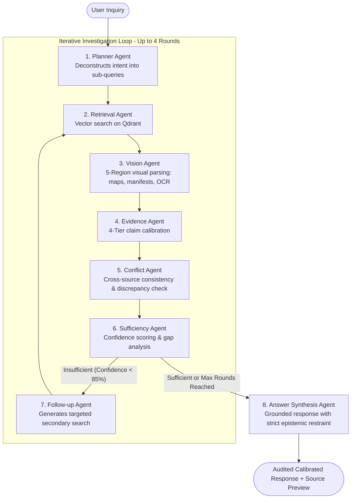

# TraceMind 🧠
### *Autonomous Multi-Agent Forensic Document Intelligence & Calibrated Reasoning System*

[](https://nodejs.org/)
[](https://react.dev/)
[](https://vite.dev/)
[](https://expressjs.com/)
[](https://qdrant.tech/)
[](https://www.cloudflare.com/products/r2/)
[](https://www.mongodb.com/)
[](https://ollama.com/)
[](https://smith.langchain.com/)

---

## 📖 Table of Contents

- [Overview](#-overview)
- [System Architecture](#-system-architecture)
- [Multi-Agent Orchestration Flow](#-multi-agent-orchestration-flow)
- [Key Features](#-key-features)
- [Prerequisites & Infrastructure](#-prerequisites--infrastructure)
- [RunPod & Ollama GPU Setup](#-runpod--ollama-gpu-setup)
- [Installation & Local Setup](#-installation--local-setup)
- [Environment Configuration](#-environment-configuration)
- [Running the Application](#-running-the-application)
- [API Reference](#-api-reference)
- [LangSmith Observability & Tracing](#-langsmith-observability--tracing)
- [Project Directory Structure](#-project-directory-structure)
- [Verification & Testing](#-verification--testing)
- [Troubleshooting & FAQ](#-troubleshooting--faq)
- [License](#-license)

---

## 🌟 Overview

**TraceMind** is an enterprise-grade, multi-agent AI document intelligence and forensic reasoning platform. Unlike traditional single-pass RAG (Retrieval-Augmented Generation) systems that struggle with multi-hop questions, complex visual layouts, and speculative hallucinations, TraceMind utilizes an **iterative multi-agent reasoning loop** grounded in strict epistemic restraint.

TraceMind autonomously breaks down complex inquiries, searches multi-format documents (PDFs, Word docs, images, manifests, handwritten notes, and ZIP archives), evaluates evidence across a 4-tier calibration scale, resolves inter-document contradictions, and generates fully auditable, grounded conclusions.

---

## 🏗 System Architecture

```text
┌─────────────────────────────────────────────────────────────────────────┐
│                        TraceMind React Frontend                         │
│      (React 19 + Vite + Modern Glassmorphism + Live Forensic Stream)    │
└────────────────────────────────────┬────────────────────────────────────┘
                                     │ HTTP REST / SSE Telemetry
┌────────────────────────────────────▼────────────────────────────────────┐
│                    TraceMind Backend Express API                        │
│ ┌─────────────────────────────────────────────────────────────────────┐ │
│ │                  ADK Multi-Agent Orchestrator                       │ │
│ │  ┌───────────────┐  ┌──────────────────┐  ┌───────────────────────┐ │ │
│ │  │ Planner Agent │  │ Retrieval Agent  │  │ Vision Analyst Agent  │ │ │
│ │  └───────┬───────┘  └────────┬─────────┘  └──────────┬────────────┘ │ │
│ │          │                   │                       │              │ │
│ │  ┌───────▼───────┐  ┌────────▼─────────┐  ┌──────────▼────────────┐ │ │
│ │  │Evidence Agent │  │ Conflict Agent   │  │ Sufficiency Agent     │ │ │
│ │  └───────┬───────┘  └────────┬─────────┘  └──────────┬────────────┘ │ │
│ │          │                   │                       │              │ │
│ │  ┌───────▼───────────────────▼───────────────────────▼────────────┐ │ │
│ │  │          Answer Synthesis & Follow-up Agents                   │ │ │
│ │  └────────────────────────────────────────────────────────────────┘ │ │
│ └─────────────────────────────────────────────────────────────────────┘ │
└───────┬─────────────────────┬───────────────────────────┬───────────────┘
        │                     │                           │               │
        ▼                     ▼                           ▼               ▼
┌──────────────────┐  ┌──────────────────┐  ┌─────────────────────────┐ ┌─────────────────────────┐
│  Cloudflare R2   │  │  Qdrant Vector   │  │      RunPod GPU         │ │     LangSmith Cloud     │
│  Object Storage  │  │     Database     │  │  (Ollama AI Engine)     │ │  (Observability/Tracing)│
│ (Raw Docs/Images)│  │ (Dense Embedding │  │  - qwen3:14b            │ │  - Hierarchical Spans   │
│                  │  │  + Metadata)     │  │  - qwen3-vl:8b          │ │  - Latency & Token Evals│
│                  │  │                  │  │  - nomic-embed-text     │ │  - Automated Redaction  │
└──────────────────┘  └──────────────────┘  └─────────────────────────┘ └─────────────────────────┘
```

---

## 🤖 Multi-Agent Orchestration Flow

TraceMind employs an 8-agent collaborative loop built upon the Google ADK (Agent Development Kit) design pattern:



### 🔬 The 8 Specialized Agents:
1. **Planner Agent**: Analyzes user questions, detects document modalities, and formulates an initial search strategy.
2. **Retrieval Agent**: Performs dense semantic similarity searches against the Qdrant Cloud vector index.
3. **Vision Agent**: Uses multi-region visual intelligence (`qwen3-vl:8b`) to extract fine details from maps, routes, distances, harbor photos, shipping manifests, item IDs, handwritten notes, and legends.
4. **Evidence Evaluation Agent**: Classifies extracted claims into 4 epistemological tiers:
   - `VERIFIED FACT`: Explicitly written or directly visible in sources.
   - `STRONG INFERENCE`: Strongly corroborated across independent records.
   - `POSSIBLE INFERENCE`: Plausible hypotheses not yet directly proven.
   - `UNKNOWN / NOT ESTABLISHED`: Insufficient evidence to substantiate.
5. **Conflict Resolution Agent**: Detects contradictions, dates/route mismatches, or conflicting identifiers across multiple files.
6. **Information Sufficiency Agent**: Dynamically computes evidence completeness scores and determines if another search round is required.
7. **Follow-up Agent**: Reformulates focused search queries to fill identified knowledge gaps.
8. **Answer Synthesis Agent**: Compiles the final response adhering to strict epistemic constraints—ensuring inferences are never presented as facts and prohibiting ungrounded speculative terms.

---

## ✨ Key Features

- **Multi-Format Document Ingestion**: Seamlessly process and extract text from `PDF`, `DOCX`, `TXT`, `MD`, `PNG`, `JPG`, `WEBP`, and multi-file `ZIP` archives.
- **5-Region Visual Intelligence**: Full OCR and spatial reasoning across complex visual documents:
  - *Region 1: Map / Cartographic Areas* (routes, distances, arrows, waypoints)
  - *Region 2: Photographic Records* (facility identifiers, crate labels, environmental context)
  - *Region 3: Structured Tables / Manifests* (item IDs, quantities, origin, destination)
  - *Region 4: Handwritten Annotations* (stamps, margins, handwritten corrections)
  - *Region 5: Legends & Footnotes* (symbology, classification scales, measurement keys)
- **Direct Clipboard Screenshot Pasting**: Capture screenshots via `Win + Shift + S` or `Cmd + Shift + 4` and paste them directly (`Ctrl + V`) into the chat input for instant OCR, vectorization, and reasoning.
- **End-to-End LangSmith Observability & Tracing**: Production-grade distributed tracing of the multi-agent reasoning loop (`traceInvestigation`, `traceAgent`, `traceRetrievalSpan`, `traceLlmCall`). Captures agent run trees, dynamic sufficiency confidence scores, retrieval latencies, and token usage metrics with automated PII and vector payload sanitization.
- **Real-Time Forensic Telemetry Stream**: Server-Sent Events (SSE) telemetry mapping real-time agent execution rounds, confidence metrics, multi-hop sub-tasks, and evidence state transitions.
- **Enterprise Storage & Vector Search**: Cloudflare R2 object storage with pre-signed direct streaming and Qdrant Cloud vector indexing with Nomic embeddings.
- **Comprehensive User Auth & Audit Trail**: JWT session authentication, bcrypt password hashing, SMTP email verification, and complete document management.

---

## 📋 Prerequisites & Infrastructure

Before running TraceMind, ensure you have the following installed and configured:

| Component | Minimum Version | Notes |
| :--- | :--- | :--- |
| **Node.js** | `v18.0.0` or higher | Recommended `v20.x LTS` or `v22.x` |
| **npm** | `v9.0.0` or higher | Included with Node.js |
| **MongoDB** | `v6.0+` | Local instance or [MongoDB Atlas](https://www.mongodb.com/atlas) cluster |
| **Qdrant** | `v1.9+` | [Qdrant Cloud](https://cloud.qdrant.io/) cluster or self-hosted |
| **Cloudflare R2** | — | S3-compatible bucket for raw file storage |
| **SMTP Service** | — | [Mailtrap](https://mailtrap.io/) (dev) or Gmail/SendGrid (prod) |
| **GPU Instance** | — | [RunPod](https://runpod.io/) (L40 48GB / RTX 4090 / A100) or local CUDA GPU with [Ollama](https://ollama.com/) |
| **LangSmith** | — | [LangSmith](https://smith.langchain.com/) for multi-agent observability & trace debugging (optional) |

---

## ⚡ RunPod & Ollama GPU Setup

TraceMind uses **Ollama** on a cloud GPU instance (e.g. RunPod) to execute high-performance open-source models for reasoning, vision analysis, and dense vector embeddings.

### 1. Launch a RunPod Instance
- **Recommended GPU**: NVIDIA L40 (48GB VRAM), RTX 4090 (24GB VRAM), or A100 (80GB).
- **Template**: Official `RunPod PyTorch` or `Ubuntu 22.04 / CUDA 12.x`.
- **Exposed HTTP Ports**: Ensure port **`11434`** is exposed under **HTTP Service Proxy**.

---

### 2. Commands to Execute in RunPod Terminal

Open the RunPod **Web Terminal** or connect via **SSH**, then run the following commands in sequence:

#### Step 1: Install Ollama
```bash
curl -fsSL https://ollama.com/install.sh | sh
```

#### Step 2: Start Ollama Daemon (Bound to all network interfaces with keep-alive)
```bash
# Set OLLAMA_HOST to 0.0.0.0 so the RunPod proxy can access port 11434
export OLLAMA_HOST=0.0.0.0:11434
export OLLAMA_KEEP_ALIVE=-1

# Launch in background with nohup (or run inside tmux)
nohup ollama serve > ollama.log 2>&1 &
```

*(Optional: To monitor Ollama logs live in RunPod, run: `tail -f ollama.log`)*

#### Step 3: Pull All Required AI Models
Execute each of the following model download commands:

```bash
# 1. Primary Text Reasoning & Epistemic Calibration Model (14B)
ollama pull qwen3:14b

# 2. Vision Intelligence & OCR Model (8B)
ollama pull qwen3-vl:8b

# 3. Dense Vector Embeddings Model (768-dim)
ollama pull nomic-embed-text
```

---

### 3. Verify Ollama & Models on RunPod

Test that Ollama is actively running and all three models are ready:

```bash
# Check loaded models list
curl http://localhost:11434/api/tags
```

You should receive a JSON response listing `qwen3:14b`, `qwen3-vl:8b`, and `nomic-embed-text`.

---

### 4. Connect TraceMind to your RunPod Instance

1. In your RunPod dashboard, click **Connect** on your active Pod.
2. Locate the **HTTP Service Proxy (Port 11434)** URL. It will look like:
   ```text
   https://<YOUR-RUNPOD-ID>-11434.proxy.runpod.net
   ```
3. Copy this URL and set it in your local `src/backend/.env` file:
   ```env
   OLLAMA_BASE_URL=https://<YOUR-RUNPOD-ID>-11434.proxy.runpod.net
   OLLAMA_TEXT_MODEL=qwen3:14b
   OLLAMA_VISION_MODEL=qwen3-vl:8b
   OLLAMA_EMBEDDING_MODEL=nomic-embed-text
   ```
4. Verify external connectivity from your local machine terminal:
   ```bash
   curl https://<YOUR-RUNPOD-ID>-11434.proxy.runpod.net/api/tags
   ```

---

## 💻 Installation & Local Setup

### 1. Clone the Repository
```bash
git clone https://github.com/Risi2004/TraceMind.git
cd TraceMind
```

### 2. Install All Dependencies
Install backend and frontend dependencies in one command from the project root:
```bash
npm run install:all
```
*(Or install manually by running `npm install` inside both `src/backend` and `src/frontend`)*

---

## ⚙️ Environment Configuration

### Backend Configuration (`src/backend/.env`)

Copy the example template:
```bash
cp src/backend/.env.example src/backend/.env
```

Edit `src/backend/.env` with your actual credentials:

```env
# -------------------------------------------------------------
# Server & Environment Settings
# -------------------------------------------------------------
PORT=5000
NODE_ENV=development
CLIENT_URL=http://localhost:5173

# -------------------------------------------------------------
# MongoDB Connection
# -------------------------------------------------------------
MONGODB_URI=mongodb://127.0.0.1:27017/tracemind
# (Or MongoDB Atlas: mongodb+srv://<user>:<password>@cluster.mongodb.net/tracemind)

# -------------------------------------------------------------
# Authentication & Security
# -------------------------------------------------------------
JWT_SECRET=your_super_secret_jwt_encryption_key_change_in_production
JWT_EXPIRES_IN=7d

# -------------------------------------------------------------
# SMTP Email Service (Mailtrap or Gmail)
# -------------------------------------------------------------
SMTP_HOST=smtp.mailtrap.io
SMTP_PORT=2525
SMTP_SECURE=false
SMTP_USER=your_mailtrap_username
SMTP_PASS=your_mailtrap_password
EMAIL_FROM_NAME="TraceMind AI"
EMAIL_FROM_ADDRESS="no-reply@tracemind.ai"

# -------------------------------------------------------------
# Cloudflare R2 Document Storage
# -------------------------------------------------------------
R2_ACCOUNT_ID=your_cloudflare_account_id
R2_ACCESS_KEY_ID=your_r2_access_key_id
R2_SECRET_ACCESS_KEY=your_r2_secret_access_key
R2_BUCKET_NAME=tracemind-documents
R2_ENDPOINT=https://<your_cloudflare_account_id>.r2.cloudflarestorage.com
MAX_UPLOAD_SIZE_MB=300

# -------------------------------------------------------------
# Ollama / RunPod AI Engine Configuration
# -------------------------------------------------------------
OLLAMA_BASE_URL=https://<your-runpod-id>-11434.proxy.runpod.net
OLLAMA_TEXT_MODEL=qwen3:14b
OLLAMA_VISION_MODEL=qwen3-vl:8b
OLLAMA_EMBEDDING_MODEL=nomic-embed-text

# -------------------------------------------------------------
# Qdrant Cloud Vector Database
# -------------------------------------------------------------
QDRANT_URL=https://<your-cluster-id>.<region>.cloud.qdrant.io:6333
QDRANT_API_KEY=your_qdrant_api_key_here
QDRANT_COLLECTION=tracemind_chunks

# -------------------------------------------------------------
# Multi-Agent RAG Parameters
# -------------------------------------------------------------
RAG_TOP_K=8
MAX_SEARCH_ROUNDS=4
ENABLE_ADK_DEBUG_LOGS=true

# -------------------------------------------------------------
# LangSmith Observability & Tracing (Optional)
# -------------------------------------------------------------
LANGSMITH_TRACING=true
LANGSMITH_API_KEY=your_langsmith_api_key_here
LANGSMITH_PROJECT=TraceMind
LANGSMITH_ENDPOINT=https://api.smith.langchain.com
```

### Frontend Configuration (`src/frontend/.env`)

Copy the example template:
```bash
cp src/frontend/.env.example src/frontend/.env
```

Edit `src/frontend/.env`:
```env
VITE_API_BASE_URL=http://localhost:5000/api
VITE_APP_TITLE=TraceMind
```

---

## 🚀 Running the Application

You can start both backend and frontend development servers independently from the root workspace:

```bash
# Terminal 1: Launch Backend API Server (http://localhost:5000)
npm run dev:backend

# Terminal 2: Launch Frontend SPA (http://localhost:5173)
npm run dev:frontend
```

### Available NPM Scripts Reference

| Command | Target | Description |
| :--- | :--- | :--- |
| `npm run install:all` | Root | Installs dependencies for both backend and frontend |
| `npm run dev:backend` | Backend | Starts Express server with `nodemon` live reload on port `5000` |
| `npm run dev:frontend` | Frontend | Starts Vite dev server with Hot Module Replacement on port `5173` |
| `npm run start:backend` | Backend | Runs the production backend node process |
| `npm run build:frontend` | Frontend | Compiles production-ready frontend bundle into `src/frontend/dist` |
| `npm run lint:frontend` | Frontend | Executes ESLint across all React frontend components |

---

## 📡 API Reference

### 1. System & Health Check
- `GET /api` — Service information, active modules, and API metadata.
- `GET /api/health` — Real-time health status of MongoDB, Qdrant, R2, and Ollama connections.

### 2. Authentication (`/api/auth`)
- `POST /api/auth/register` — Register a new user account and dispatch verification email.
- `POST /api/auth/login` — Authenticate credentials and return JWT session token.
- `POST /api/auth/verify-email` — Verify email via verification token.
- `POST /api/auth/forgot-password` — Request password reset email.
- `POST /api/auth/reset-password` — Set new password using reset token.
- `GET /api/auth/me` — Retrieve current authenticated user profile (`Bearer JWT`).

### 3. Document Management (`/api/documents`)
- `POST /api/documents/upload` — Upload files (`multipart/form-data`) to Cloudflare R2, trigger background chunking, visual parsing, and Qdrant vector indexing.
- `GET /api/documents` — List all user uploaded documents with indexing status and metadata.
- `GET /api/documents/:id` — Get document details and direct pre-signed access URL.
- `DELETE /api/documents/:id` — Delete document from R2 storage and purge vector embeddings from Qdrant.

### 4. Multi-Agent Reasoning & RAG (`/api/rag`)
- `POST /api/rag/chat` — Execute full multi-agent investigation workflow (`{ query, conversationHistory }`). Returns calibrated response, source references, and agent execution telemetry.
- `GET /api/rag/stream` — Real-time Server-Sent Events (SSE) telemetry stream for live agent execution and forensic tracing.

---

## 🔭 LangSmith Observability & Tracing

TraceMind provides deep enterprise observability by integrating **LangSmith** for distributed tracing, latency evaluation, and performance monitoring across all 8 agents in the forensic reasoning loop.

### Tracing Architecture & Hierarchical Spans
When `LANGSMITH_TRACING=true` and a valid `LANGSMITH_API_KEY` is configured, every user inquiry automatically creates a structured, hierarchical run tree in LangSmith:

- **Root Investigation Span (`traceInvestigation`)**: Wraps the entire end-to-end investigation lifecycle. It captures high-level telemetry including total reasoning rounds executed, cumulative evidence chunks analyzed, final epistemic confidence scores, conflict status, and overall response time.
- **Agent Execution Spans (`traceAgent`)**: Each of the 8 ADK agents (`Planner`, `Retrieval`, `Vision`, `Evidence`, `Conflict`, `Sufficiency`, `Follow-up`, and `Answer`) executes as a dedicated child span, logging its specific round number, inputs, and state updates.
- **Dense Retrieval Spans (`traceRetrievalSpan`)**: Traces sub-operations such as Query Embedding generation, Qdrant Vector Nearest-Neighbor search, and similarity score ranking.
- **LLM Inference Spans (`traceLlmCall`)**: Tracks all remote Ollama calls (`qwen3:14b`, `qwen3-vl:8b`), calculating estimated token metrics (prompt & completion tokens), measuring execution duration in milliseconds, and capturing error diagnostics if an inference fails.

### Privacy-Preserving Payload Sanitization
TraceMind enforces strict data privacy controls to prevent sensitive information or oversized payloads from polluting your LangSmith dashboard:
- **Credential Redaction**: Sensitive attributes such as API keys, JWT tokens, authorization headers, and passwords are automatically scrubbed and replaced with `[REDACTED]`.
- **Vector Truncation**: Dense 768-dimensional embedding vectors are summarized as `{ _type: 'embedding_vector', dimensions: 768, sample: [...] }` rather than logging massive float arrays.
- **Binary & Image Buffer Truncation**: High-resolution image buffers and raw file bytes are replaced with concise length indicators (`[BINARY_BUFFER]`).
- **Retrieval Chunk Summarization**: Raw chunks are sanitized to essential provenance metadata (filename, page number, similarity score) with text excerpts capped at 160 characters.

### Enabling LangSmith
1. Create a free account at [smith.langchain.com](https://smith.langchain.com/).
2. Navigate to **Settings** > **API Keys** and generate an API key (`lsv2_pt_...`).
3. Add the following to your `src/backend/.env` file:
   ```env
   LANGSMITH_TRACING=true
   LANGSMITH_API_KEY=lsv2_pt_your_actual_api_key
   LANGSMITH_PROJECT=TraceMind
   LANGSMITH_ENDPOINT=https://api.smith.langchain.com
   ```
4. Trace sessions will now seamlessly populate under the **TraceMind** project in your LangSmith dashboard. If the API key is omitted or `LANGSMITH_TRACING=false`, the system gracefully operates in zero-overhead passthrough mode without making any external telemetry calls.

## 📂 Project Directory Structure

```text
TraceMind/
├── package.json                         # Root monorepo scripts and workspaces
├── README.md                            # Comprehensive system documentation
├── .gitignore                           # Git ignore rules for node_modules, .env, dist
├── ai_usage/                            # Challenge audit trail & interaction records
├── docs/                                # Technical documentation and specifications
└── src/
    ├── backend/                         # Express.js API Service (ES Modules)
    │   ├── index.js                     # Main server entrypoint & route binding
    │   ├── package.json                 # Backend dependencies & scripts
    │   ├── nodemon.json                 # Development live-reload configuration
    │   ├── .env.example                 # Backend environment variable template
    │   ├── agents/                      # 8-Agent Google ADK Orchestration Engine
    │   │   ├── adkOrchestrator.js       # Main multi-agent loop orchestrator
    │   │   ├── planner.agent.js         # Query analysis & sub-task planning
    │   │   ├── retrieval.agent.js       # Dense vector retrieval coordinator
    │   │   ├── vision.agent.js          # 5-Region visual parsing & OCR analyst
    │   │   ├── evidence.agent.js        # 4-Tier epistemic calibration classifier
    │   │   ├── conflict.agent.js        # Cross-document discrepancy resolver
    │   │   ├── sufficiency.agent.js     # Information sufficiency evaluator
    │   │   ├── followup.agent.js        # Knowledge gap query generator
    │   │   └── answer.agent.js          # Grounded response synthesis
    │   ├── config/                      # Database & cloud connection singletons
    │   │   ├── db.js                    # Mongoose MongoDB connection
    │   │   ├── qdrant.js                # Qdrant REST client configuration
    │   │   └── r2.js                    # Cloudflare R2 S3 SDK client
    │   ├── controllers/                 # Route controllers (Auth, Docs, RAG)
    │   ├── middleware/                  # JWT auth & Multer upload middleware
    │   ├── models/                      # Mongoose schemas (User, Document, Log)
    │   ├── routes/                      # Express route definitions
    │   ├── tests/                       # Unit & integration test suites
    │   │   └── langsmith-tracing.test.js# LangSmith tracing & telemetry unit tests
    │   └── services/                    # Core business logic services
    │       ├── chunking.service.js      # Text & table token chunking
    │       ├── extractor.service.js     # PDF, DOCX, ZIP, Image text extractors
    │       ├── ingestion.service.js     # End-to-end document indexing pipeline
    │       ├── langsmith.service.js     # LangSmith multi-agent tracing & sanitization
    │       ├── ollama.service.js        # Ollama API client & model manager
    │       ├── qwen.service.js          # Calibrated Qwen text reasoning service
    │       ├── qdrant.service.js        # Vector upsert & similarity search
    │       ├── r2.service.js            # Cloudflare R2 upload & pre-signed URLs
    │       └── vision.service.js        # Image encoding & visual analysis
    │
    └── frontend/                        # React SPA (Vite + React 19)
        ├── index.html                   # HTML SPA template
        ├── vite.config.js               # Vite bundler & React Compiler config
        ├── package.json                 # Frontend dependencies & scripts
        ├── .env.example                 # Frontend environment template
        └── src/
            ├── App.jsx                  # Main application router and shell
            ├── main.jsx                 # React root DOM mount point
            ├── index.css                # Global design system & glassmorphism theme
            ├── context/                 # AuthContext & InvestigationContext
            ├── pages/                   # ChatDashboard, Auth, Landing pages
            └── components/              # Modular UI Component Library
                ├── chat/                # ChatInput, MessageList, InvestigationPanel
                ├── documents/           # DocumentsView, UploadDropzone, FilePreview
                ├── common/              # Buttons, Modals, Spinners, Toast alerts
                └── Hero/                # Landing page hero & features showcase
```

---

## 🧪 Verification & Testing

TraceMind includes dedicated test suites for validating backend services, vector storage, and visual reasoning:

### 1. Test Multi-Agent Evaluation Suite
Run the comprehensive ADK multi-agent evaluation benchmark:
```bash
cd src/backend
node test_adk_evaluation_suite.js
```

### 2. Verify LangSmith Tracing & Sanitization
Execute the automated LangSmith integration test suite (validates configuration detection, privacy redactions, vector array truncations, and span hierarchies):
```bash
cd src/backend
node tests/langsmith-tracing.test.js
```

### 3. Verify Frontend Production Build
Validate that the React application compiles cleanly without errors:
```bash
npm run build:frontend
```

---

## ❓ Troubleshooting & FAQ

<details>
<summary><b>1. Ollama on RunPod returns connection refused or 404</b></summary>
<p>Ensure that the Ollama process on your RunPod is running with <code>OLLAMA_HOST=0.0.0.0:11434</code>. If bound only to <code>localhost</code>, external proxy requests will be rejected. Verify that port <code>11434</code> is exposed in your RunPod pod settings.</p>
</details>

<details>
<summary><b>2. Qdrant returns Collection Not Found (404)</b></summary>
<p>TraceMind automatically checks and creates the collection defined in <code>QDRANT_COLLECTION</code> (default: <code>tracemind_chunks</code>) with 768-dimensional cosine distance vectors upon server startup. Ensure your <code>QDRANT_URL</code> and <code>QDRANT_API_KEY</code> are valid.</p>
</details>

<details>
<summary><b>3. Clipboard image paste not working in chat</b></summary>
<p>Ensure your browser has clipboard permissions enabled. Taking a screenshot with <code>Win + Shift + S</code> (Windows) or <code>Cmd + Shift + 4</code> (Mac) saves raw PNG bytes to your clipboard; pressing <code>Ctrl + V</code> inside the chat input will automatically stage the screenshot for upload.</p>
</details>

<details>
<summary><b>4. Email verification not sending</b></summary>
<p>For development, use <a href="https://mailtrap.io/">Mailtrap</a> and configure your credentials under <code>SMTP_USER</code> and <code>SMTP_PASS</code> in <code>src/backend/.env</code>. All test emails will be captured safely in your Mailtrap inbox.</p>
</details>

---

## 📄 License

This project is licensed under the **ISC License**. Developed for the **SLIIT CODEFEST 2026 - AI Innovation Challenge Powered By IFS**.

---

<p align="center">
  <b>Built with ❤️ by the Team HyperNova</b><br>
  <i>Empowering Grounded, Calibrated Multi-Agent Document Intelligence</i>
</p>
